# Local LLM Hub for Obsidian

**Your company's security policy blocks cloud APIs. But you refuse to give up AI-powered note automation.**

Local LLM Hub brings the full power of [Gemini Helper](https://github.com/takeshy/obsidian-gemini-helper)'s workflow automation, RAG, MCP integration, and agent skills to a **completely local** environment. Ollama, LM Studio, vLLM, or AnythingLLM — your data never leaves your machine.

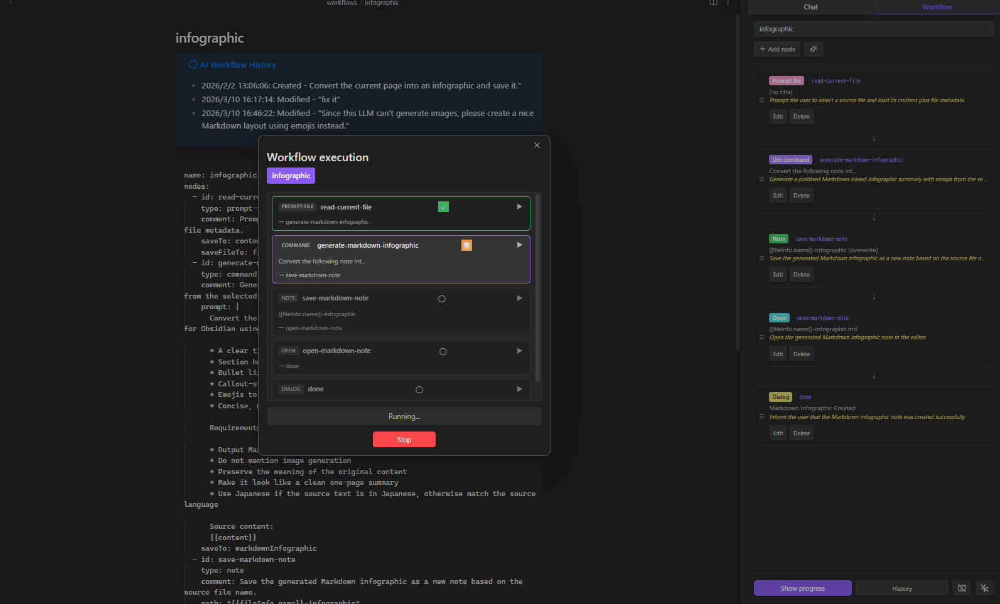

---

## Why Local?

Every byte stays on your machine. No API keys sent to the cloud. No vault contents uploaded anywhere. This isn't a privacy "option" — it's the architecture.

| What | Where it stays |
|------|---------------|
| Chat history | Markdown files in your vault |
| RAG index | Local embeddings in workspace folder |
| LLM requests | `localhost` only (Ollama / LM Studio / vLLM / AnythingLLM) |
| MCP servers | Local child processes via stdio |
| Encrypted files | Encrypted/decrypted locally |
| Edit history | In-memory (cleared on restart) |

> If you use [Gemini Helper](https://github.com/takeshy/obsidian-gemini-helper) at home but need something for work — this is it. Same workflow engine, same UX, zero cloud dependency.

---

## Workflow Automation — The Core Feature

Describe what you want in plain language. The AI builds the workflow. No YAML knowledge required.

### Create Workflows & Skills with AI

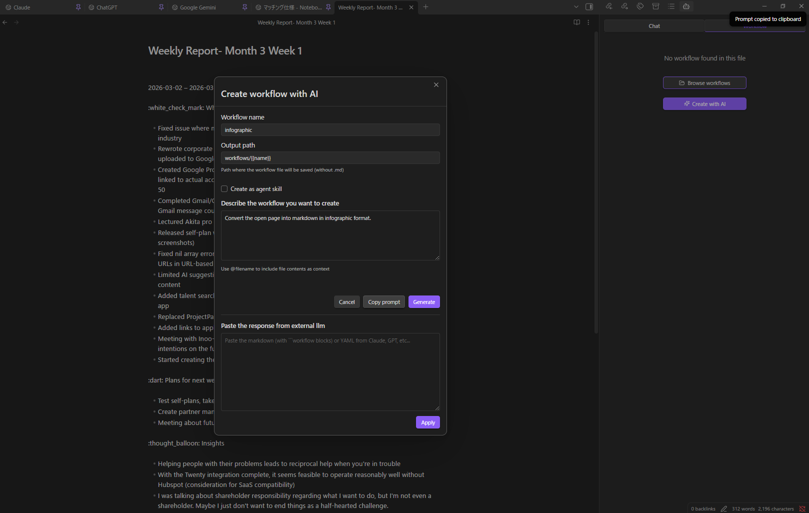

1. Open the **Workflow** tab → select **+ New (AI)**
2. Describe: *"Convert the current page into an infographic and save it"*
3. Check **"Create as agent skill"** if you want to create an agent skill instead of a standalone workflow
4. Click **Generate** — done

Don't have a powerful local model? Click **Copy Prompt**, paste into Claude/GPT/Gemini, paste the response back, and click **Apply**.

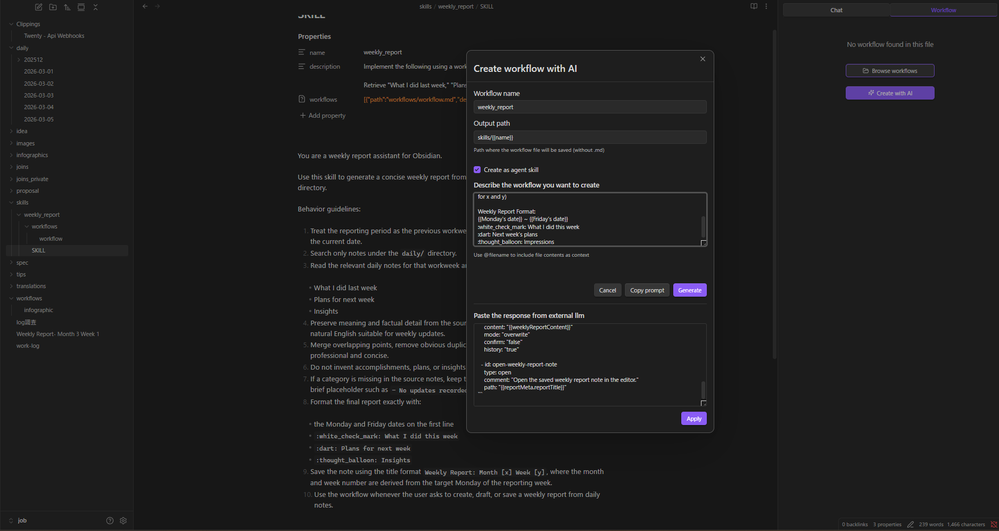

### Modify with AI

Load any workflow, click **AI Modify**, describe the change. Reference execution history to debug failures.

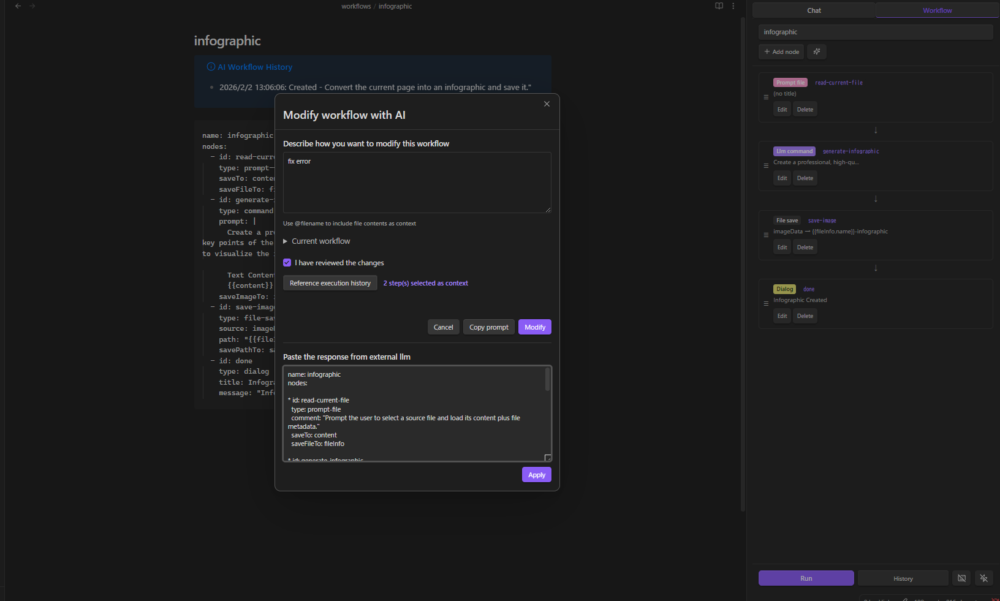

### Visual Node Editor

23 node types across 12 categories:

| Category | Nodes |
|----------|-------|
| Variables | `variable`, `set` |
| Control | `if`, `while` |
| LLM | `command` |
| Data | `http`, `json` |
| Notes | `note`, `note-read`, `note-search`, `note-list`, `folder-list`, `open` |
| Files | `file-explorer`, `file-save` |
| Prompts | `prompt-file`, `prompt-selection`, `dialog` |
| Composition | `workflow` (sub-workflows) |
| RAG | `rag-sync` |
| Script | `script` (sandboxed JavaScript) |
| External | `obsidian-command` |
| Utility | `sleep` |

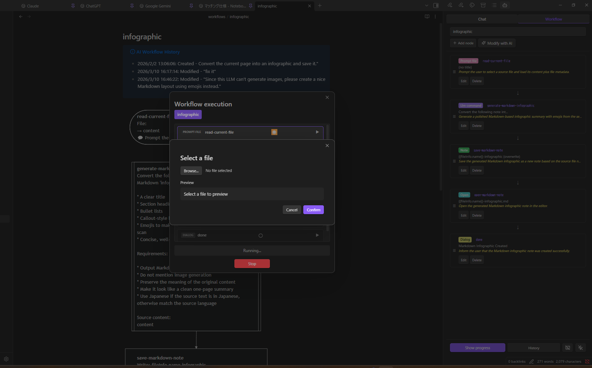

### Event Triggers & Hotkeys

- **Event triggers** — auto-run workflows on file create / modify / delete / rename / open
- **Hotkey support** — assign keyboard shortcuts to any named workflow
- **Execution history** — review past runs with step-by-step details

See [WORKFLOW_NODES.md](docs/WORKFLOW_NODES.md) for the complete node reference.

---

## AI Chat

Streaming chat with your local LLM. Thinking display, file attachments, `@` mentions for vault notes, multiple sessions.

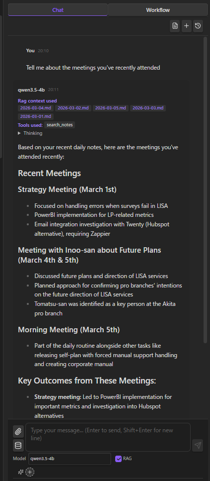

### Vault Tools (Function Calling)

Models with function calling support (Qwen, Llama 3.1+, Mistral) can directly interact with your vault:

`read_note` · `create_note` · `update_note` · `rename_note` · `create_folder` · `search_notes` · `list_notes` · `list_folders` · `get_active_note` · `propose_edit` · `execute_javascript`

Three modes — **All**, **No Search**, **Off** — selectable from the input area.

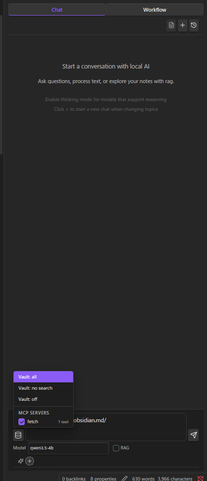

### MCP Servers

Connect local [MCP](https://modelcontextprotocol.io/) servers to extend the AI with external tools. MCP tools are merged with vault tools and routed via function calling — all running as **local child processes**.

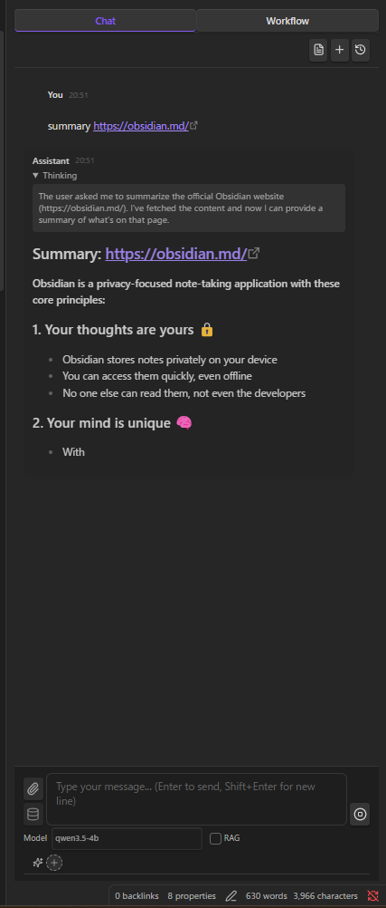

### RAG (Local Embeddings)

Index your vault with a local embedding model (e.g. `nomic-embed-text`). Relevant notes are automatically included as context. Everything computed and stored locally.

### Agent Skills

Inject reusable instructions into the system prompt via `SKILL.md` files. Activate per conversation. Skills can also expose workflows that the AI can invoke as tools during chat.

Create skills the same way as workflows — select **+ New (AI)**, check **"Create as agent skill"**, and describe what you want. The AI generates both the `SKILL.md` instructions and the workflow.

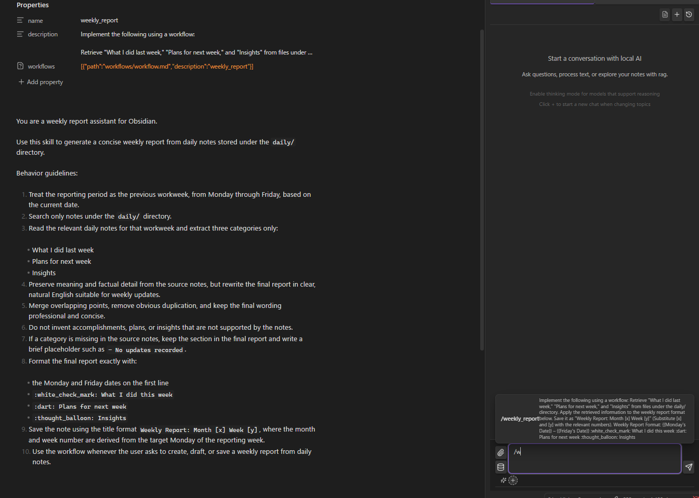

See [SKILLS.md](docs/SKILLS.md) for details.

### Slash Commands & Compact History

- Custom prompt templates triggered by `/`
- `/compact` to compress long conversations while preserving context

### File Encryption

Password-protect sensitive notes. Encrypted files are invisible to AI chat tools but accessible to workflows with password prompt — ideal for storing API keys or credentials.

### Edit History

Automatic tracking of AI-made changes with diff view and one-click restore.

---

## Setup

### Requirements

- [Ollama](https://ollama.com/), [LM Studio](https://lmstudio.ai/), [vLLM](https://docs.vllm.ai/), or [AnythingLLM](https://anythingllm.com/)
- A chat model (e.g. `ollama pull qwen3.5:4b`)
- **For RAG**: an embedding model (e.g. `ollama pull nomic-embed-text`)

### Quick Start

1. Install and start your LLM server
2. Open plugin settings → select framework (Ollama / LM Studio / vLLM / AnythingLLM)
3. Set the server URL (defaults pre-filled)
4. Fetch and select your chat model
5. Click **Verify connection**

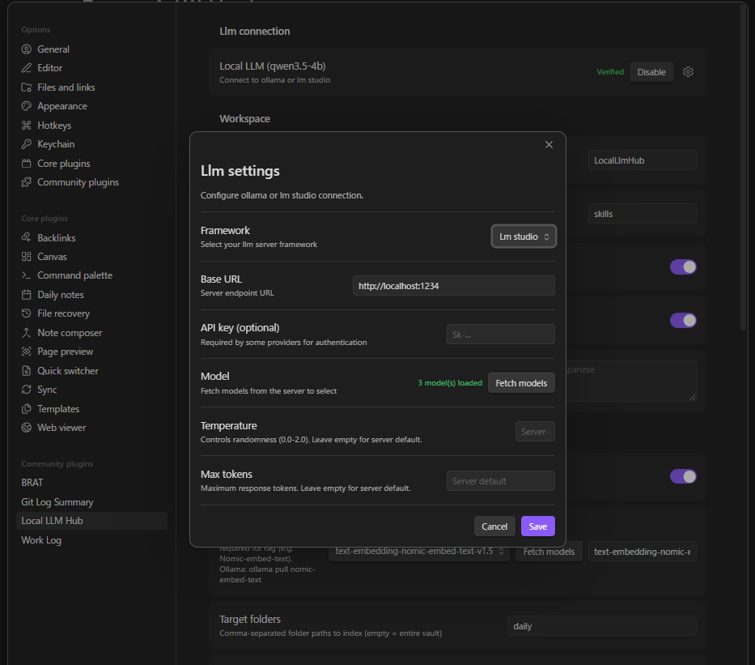

### RAG Setup

1. Enable RAG in settings
2. Fetch and select the embedding model
3. Configure target folders (optional — defaults to entire vault)
4. Click **Sync** to build the index

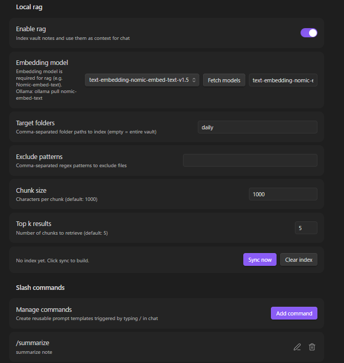

### MCP Server Setup

1. Settings → **MCP servers** → **Add server**
2. Configure: name, command (e.g. `npx`), arguments, optional env vars
3. Toggle on — connects automatically via stdio

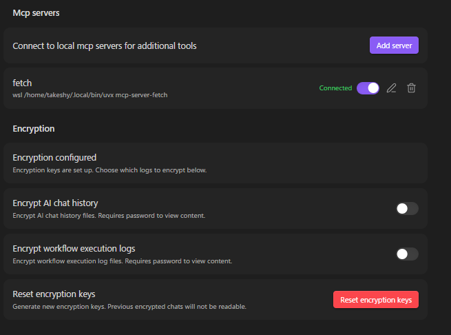

### Workspace Settings

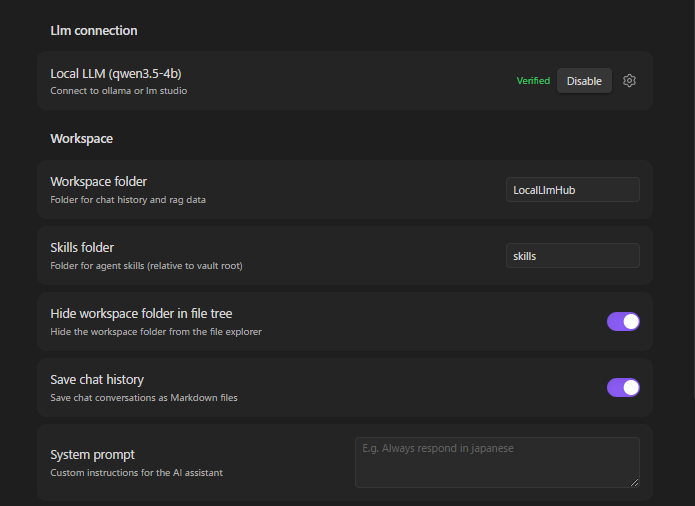

### Supported Frameworks

| Framework | Chat Endpoint | Streaming | Thinking | Function Calling |
|-----------|--------------|-----------|----------|-----------------|
| Ollama | `/api/chat` (native) | Real-time | `message.thinking` field | `tools` parameter |
| LM Studio | `/v1/chat/completions` | SSE | `<think>` tags | `tools` parameter |
| vLLM | `/v1/chat/completions` | SSE | `<think>` tags | `tools` parameter |
| AnythingLLM | `/v1/openai/chat/completions` | SSE | `<think>` tags | `tools` parameter |

---

## Installation

### BRAT (Recommended)
1. Install [BRAT](https://github.com/TfTHacker/obsidian42-brat) plugin
2. Open BRAT settings → "Add Beta plugin"
3. Enter: `https://github.com/takeshy/obsidian-local-llm-hub`
4. Enable the plugin in Community plugins settings

### Manual
1. Download `main.js`, `manifest.json`, `styles.css` from releases
2. Create `local-llm-hub` folder in `.obsidian/plugins/`
3. Copy files and enable in Obsidian settings

### From Source
```bash
git clone https://github.com/takeshy/obsidian-local-llm-hub
cd obsidian-local-llm-hub
npm install
npm run build
```

---

## Gemini Helper との関係 / Relationship to Gemini Helper

This plugin is the **local-only sibling** of [obsidian-gemini-helper](https://github.com/takeshy/obsidian-gemini-helper). Same workflow engine, same UX patterns, but designed for environments where cloud APIs are not an option.

| | Gemini Helper | Local LLM Hub |
|---|---|---|
| LLM Backend | Google Gemini API / CLI | Ollama / LM Studio / vLLM / AnythingLLM |
| Data destination | Google servers | `localhost` only |
| Workflow engine | ✅ | ✅ (same architecture) |
| RAG | Google File Search | Local embeddings |
| MCP | ✅ | ✅ (stdio only) |
| Agent Skills | ✅ | ✅ |
| Image generation | ✅ (Gemini) | — |
| Web search | ✅ (Google) | — |
| Cost | Free / Pay-per-use | **Free forever** (your hardware) |

Choose Gemini Helper when you want cutting-edge cloud models. Choose Local LLM Hub when **privacy is non-negotiable**.
