# Local LLM Hub for Obsidian

**会社のセキュリティポリシーでクラウド API が使えない。でも、AI によるノート自動整理・ワークフロー自動化を諦めたくない人へ。**

Local LLM Hub は、[Gemini Helper](https://github.com/takeshy/obsidian-gemini-helper) のワークフロー自動化・RAG・MCP 連携・エージェントスキルを、**完全ローカル環境**で実現します。Ollama、LM Studio、vLLM、または AnythingLLM — あなたのデータは一切外に出ません。

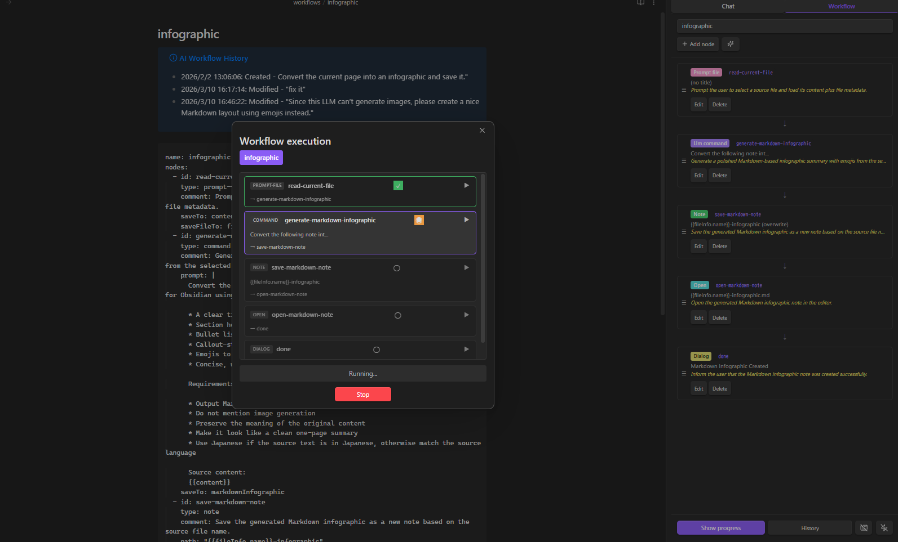

---

## なぜローカルなのか

すべてのデータがあなたのマシンに留まります。API キーがクラウドに送られることも、Vault の中身がアップロードされることもありません。プライバシーは「オプション」ではなく、**アーキテクチャそのもの**です。

| データ | 保存先 |
|--------|--------|
| チャット履歴 | Vault 内の Markdown ファイル |
| RAG インデックス | ワークスペースフォルダにローカル保存 |
| LLM リクエスト | `localhost` のみ（Ollama / LM Studio / vLLM / AnythingLLM） |
| MCP サーバー | stdio 経由のローカル子プロセス |
| 暗号化ファイル | ローカルで暗号化/復号 |
| 編集履歴 | メモリ上（再起動でクリア） |

> 自宅では [Gemini Helper](https://github.com/takeshy/obsidian-gemini-helper) を使っているけど、仕事では使えない — そんなあなたのためのプラグインです。同じワークフローエンジン、同じ UX、クラウド依存ゼロ。

---

## ワークフロー自動化 — コア機能

やりたいことを自然言語で書くだけ。AI がワークフローを組み立てます。YAML の知識は不要です。

### AI でワークフロー & スキルを作成

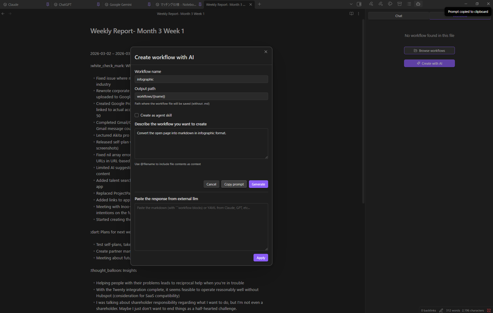

1. **Workflow / skill** タブを開く
2. **AIでワークフローを作成** をクリック（エージェントスキルを作りたい場合は **AIでスキルを作成**）
3. 説明を入力: *「現在のページをインフォグラフィックに変換して保存して」*
4. **Generate** をクリック
5. AI がまず平易な言葉の **プラン** を出力します。確認して **OK** で続行、**再計画** でフィードバックを与えてやり直し、**Cancel** で中止
6. 生成後、AI が結果を **レビュー** します。問題が見つかった場合は **OK**（確認ダイアログ付き）、**再修正**（レビューフィードバックで再生成）、**Cancel** から選択。問題なしの場合は自動で続行
7. 生成 YAML が不正だった場合、プラグインがパースエラーを LLM に渡して最大 2 回自動修復を試みます。それでも失敗した場合は生出力付きのリカバリ画面が表示されます
8. 最終プレビューを承認するとワークフローが保存されます

ローカルの LLM だけでは力不足？ **Copy Prompt** をクリックして Claude / GPT / Gemini に貼り付け、レスポンスを貼り戻して **Apply** すれば OK です。

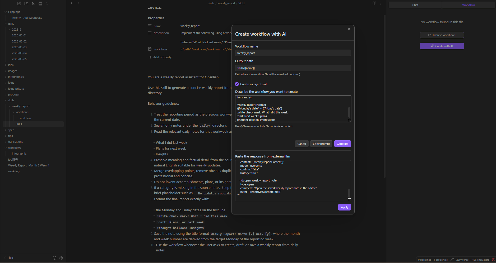

**任意のファイルからワークフロー / スキルを作成：**

ワークフローコードブロックがないファイルで Workflow / skill タブを開くと、**「AIでワークフローを作成」** と **「AIでスキルを作成」** の 2 つのボタンが表示されます。また、アクティブファイルが `SKILL.md` のときはヘッダーにも **AIでスキルを作成** が **AIでスキルを修正** と並んで表示され、パネルを離れずに新しいスキルを立ち上げられます。

### AI でワークフローを修正

既存のワークフローを読み込み、**AI Modify** をクリックして変更内容を説明するだけ。作成時と同じ plan → generate → review フローが実行されます。レビュー結果に対して **再修正** を何度でも押せ、押すたびに新しい生成パスと新しいレビューが走るので、最終的に表示されるレビューは常に確定する YAML と一致します。実行履歴を参照してエラーのデバッグも可能です。

**AI でスキルを修正：** アクティブファイルが `SKILL.md` の場合、Workflow / skill タブには **AIでスキルを修正** ボタンが表示されます。SKILL.md の指示本文と参照先ワークフローファイルを 1 回の操作で更新し、スキルの frontmatter（name、description、workflows エントリ）を保持します。

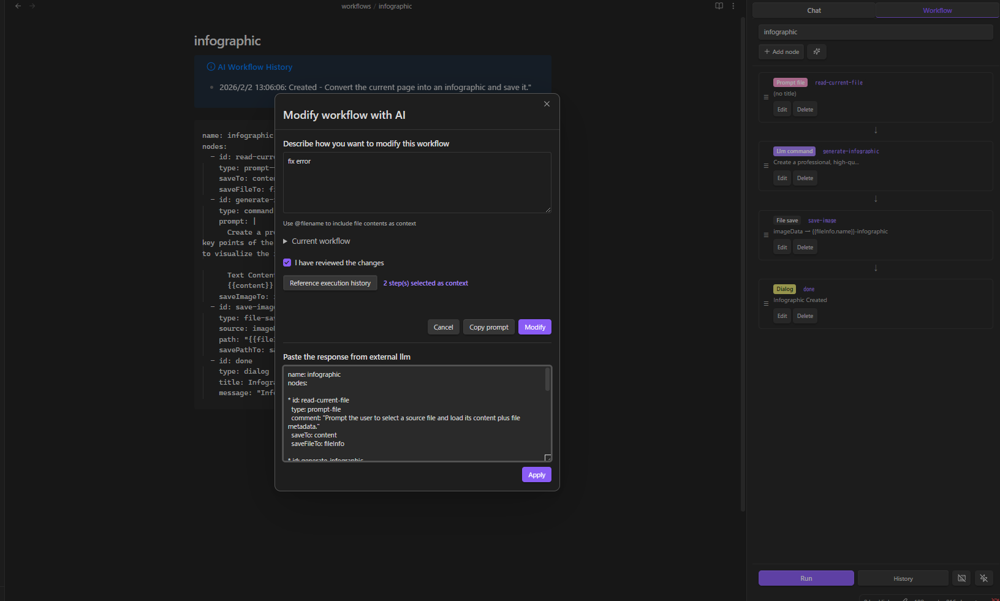

### ビジュアルノードエディタ

12 カテゴリ・23 種類のノードタイプ:

| カテゴリ | ノード |
|----------|--------|
| 変数 | `variable`, `set` |
| 制御 | `if`, `while` |
| LLM | `command` |
| データ | `http`, `json` |
| ノート | `note`, `note-read`, `note-search`, `note-list`, `folder-list`, `open` |
| ファイル | `file-explorer`, `file-save` |
| プロンプト | `prompt-file`, `prompt-selection`, `dialog` |
| 合成 | `workflow`（サブワークフロー） |
| RAG | `rag-sync` |
| スクリプト | `script`（サンドボックス JavaScript） |
| 外部連携 | `obsidian-command` |
| ユーティリティ | `sleep` |

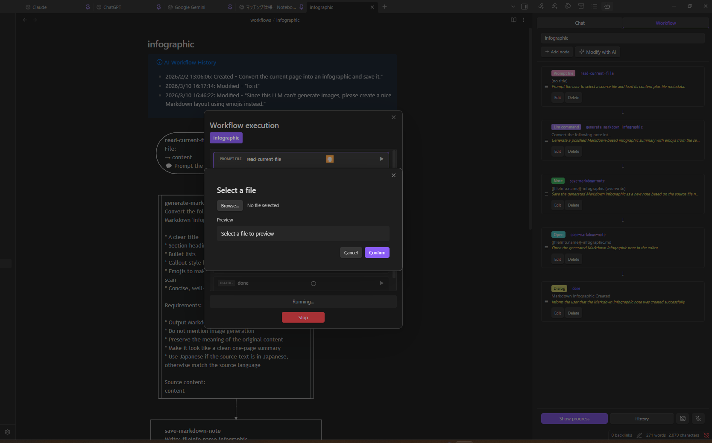

### イベントトリガー & ホットキー

- **イベントトリガー** — ファイルの作成 / 変更 / 削除 / 名前変更 / オープン時に自動実行
- **ホットキー対応** — 任意の名前付きワークフローにキーボードショートカットを割り当て
- **実行履歴** — 過去のワークフロー実行をステップごとに確認

ノードリファレンスは OKF 版の [workflow-nodes.md](docs/okf/local-llm-hub-help/features/workflow-nodes.md) を参照してください。

---

## Dashboard

レスポンシブなウィジェットグリッドで、ライブな個人用ホーム / 概要ページを作成できます。Dashboard ファイル（`.dashboard`）には Obsidian Bases ビュー、ノート、Web ページ、Timeline、ワークフロー出力、Kanban ボードを埋め込めます。通常のノートと同じように開き、表示モードでは誤操作を防ぎ、編集モードでドラッグ・リサイズによるレイアウト変更を行います。

Workflow ウィジェットは `Dashboards/Data/` の cache ファイルを表示するため、重い workflow が開くたびに再実行されることはありません。Base / Workflow ウィジェットには **Create with AI** もあり、Timeline の下書きは AI でリライトできます。組み込みの `dashboard` agent skill を使えば、チャットから Dashboard 全体と backing `.base` ファイルを作成できます。


Dashboard の詳細は OKF 版の [dashboard.md](docs/okf/local-llm-hub-help/features/dashboard.md)、[dashboard-widgets.md](docs/okf/local-llm-hub-help/features/dashboard-widgets.md)、[dashboard-schema.md](docs/okf/local-llm-hub-help/features/dashboard-schema.md) を参照してください。

---

## AI チャット

ローカル LLM とのストリーミングチャット。思考プロセス表示、ファイル添付、`@` メンションによる Vault ノート参照、複数セッション管理。

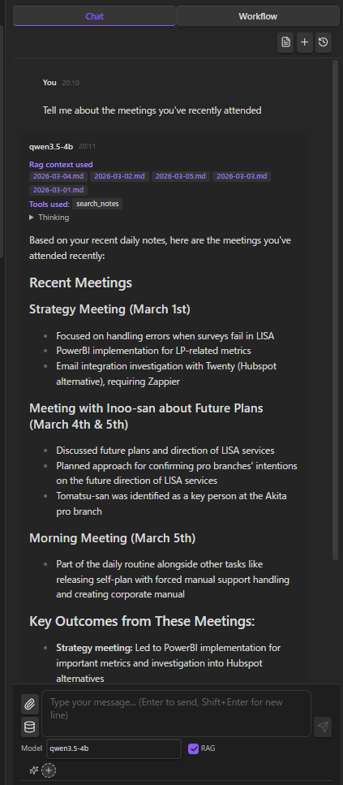

### Vault ツール（Function Calling）

Function Calling 対応モデル（Qwen、Llama 3.1+、Mistral）で Vault を直接操作:

`read_note` · `create_note` · `update_note` · `rename_note` · `create_folder` · `search_notes` · `list_notes` · `list_folders` · `get_active_note` · `propose_edit` · `execute_javascript`

**All** / **No Search** / **Off** の 3 モードを入力エリアから切り替え。

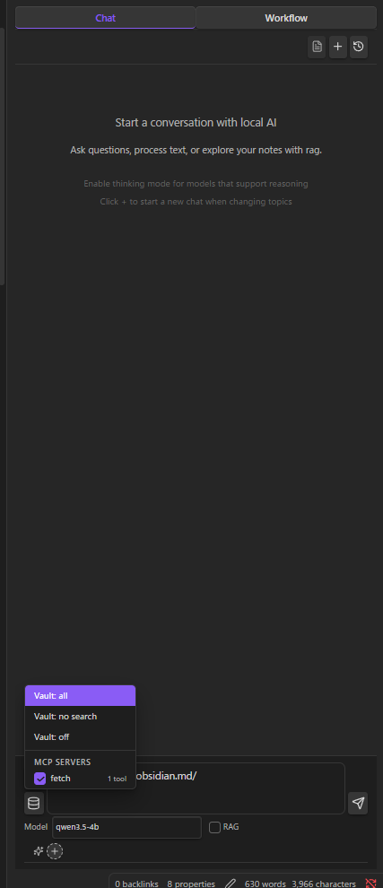

### MCP サーバー

ローカル [MCP](https://modelcontextprotocol.io/) サーバーに接続して AI の機能を外部ツールで拡張。MCP ツールは Vault ツールとマージされ、Function Calling 経由でルーティングされます — すべて**ローカル子プロセス**として実行。

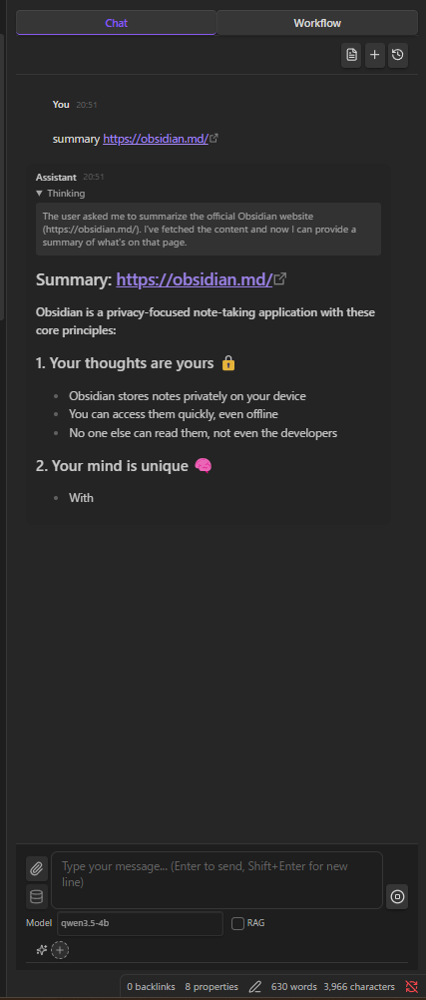

### RAG（ローカル埋め込み）

ローカルの埋め込みモデル（例: `nomic-embed-text`）で Vault をインデックス化。関連ノートと PDF がコンテキストとして自動的に含まれます。PDF テキストは PDF.js で抽出され、Markdown ファイルと同様にチャンク化されます。すべてローカルで計算・保存。

### RAG 検索

セマンティックベクトル検索、キーワードフィルター、チャンク編集、AI 整形を備えた専用検索インターフェース。


- **キーワードフィルター** — テキストやファイルパスで検索結果を絞り込み
- **チャンクエディター** — 結果テキストの編集、前後チャンクの読み込み（オーバーラップ自動除去）
- **AI 整形** — ローカル LLM でコンテキストを自動拡張しテキストを整形

詳細は OKF 版の [rag-search.md](docs/okf/local-llm-hub-help/features/rag-search.md) を参照してください。

### エージェントスキル

`SKILL.md` ファイルで再利用可能な指示をシステムプロンプトに注入。会話ごとに有効化できます。スキルはワークフローを公開でき、AI がチャット中にツールとして実行できます。

スキルの作成もワークフローと同じ方法で — Workflow / skill タブの **AIでスキルを作成** をクリックして説明を記述するだけ。AI が `SKILL.md` の指示とワークフローの両方を生成します。既存のスキルを編集するには、`SKILL.md` を開いて Workflow / skill タブの **AIでスキルを修正** をクリック。AI が指示本文と参照先ワークフローを一括で更新します。

**スキルチップをクリックで開く：** チャット入力エリアやアシスタントメッセージに表示されるアクティブなスキルチップをクリックすると、対応する `SKILL.md` が開きます（ビルトインスキルは静的ラベル表示）。

**ワークフローエラーからの復旧：** チャット中にスキルワークフローが失敗すると、失敗したツール呼び出しに **ワークフローを開く** ボタンが表示されます。クリックするとワークフローファイルが開き、Workflow / skill タブに切り替わるので、そのまま編集・再実行できます。**AI でワークフローを修正** と **実行履歴を参照** を組み合わせれば、失敗したステップを AI に直接修正させられます。

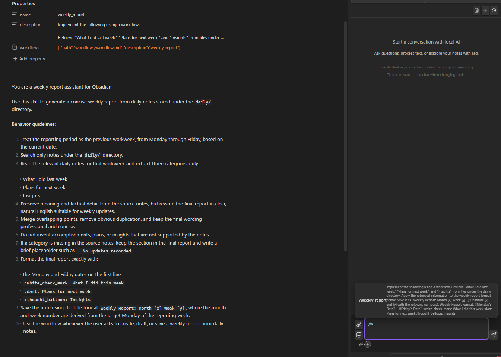

詳細は OKF 版の [agent-skills.md](docs/okf/local-llm-hub-help/features/agent-skills.md) を参照してください。

### スラッシュコマンド & 会話の圧縮

- `/` で呼び出すカスタムプロンプトテンプレート
- `/compact` で長い会話をコンテキストを保持したまま圧縮

### ファイル暗号化

機密ノートをパスワードで保護。暗号化ファイルは AI チャットのツールからは見えませんが、ワークフローからはパスワード入力で読み取り可能 — API キーや認証情報の保管に最適。

### 編集履歴

AI による変更の自動追跡、差分表示、ワンクリック復元。

---

## セットアップ

### 必要なもの

- [Ollama](https://ollama.com/)、[LM Studio](https://lmstudio.ai/)、[vLLM](https://docs.vllm.ai/)、または [AnythingLLM](https://anythingllm.com/)
- チャットモデル（例: `ollama pull qwen3.5:4b`）
- **RAG 使用時**: 埋め込みモデル（例: `ollama pull nomic-embed-text`）

### クイックスタート

1. LLM サーバーをインストール・起動
2. プラグイン設定 → フレームワーク（Ollama / LM Studio / vLLM / AnythingLLM）を選択
3. サーバー URL を設定（デフォルト値あり）
4. チャットモデルを取得・選択
5. **接続確認**をクリック

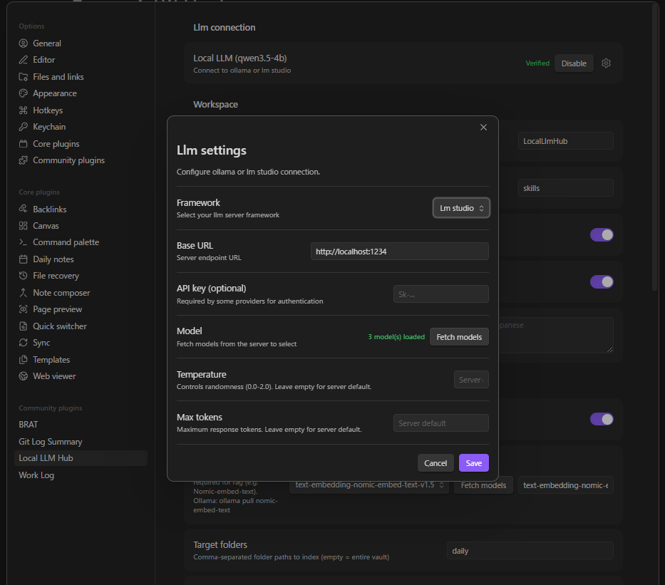

### RAG セットアップ

1. 設定で RAG を有効化
2. 埋め込みモデルを取得・選択
3. 対象フォルダを設定（省略時は Vault 全体）
4. **同期**をクリックしてインデックスを構築

大きな Vault では、フォルダごとに複数の RAG 設定を作成してそれぞれ同期し、別の RAG 設定で **内部RAG設定を結合** を有効にできます。同期済みの結合元設定を選ぶと、チャットや検索では 1 つの RAG 設定としてまとめて検索できます。結合用設定は、最初に選択した結合元設定の埋め込みサーバーとモデルを使用します。

同期時は、変更されたファイルを少数ずつ処理・保存します。これは RAG の chunk size 設定とは別の、同期処理の保存単位です。初回同期中に Obsidian がクラッシュしても、次回は保存済みの地点から再開しやすくなります。PDF のテキスト抽出に失敗した場合は、同期後に対象 PDF の一覧を表示し、checksum を保存します。その PDF はインデックス済みファイル一覧に `0 chunks` として表示され、PDF ファイル自体が変わらない限り次回以降の同期では再試行されません。再取り込みしたい場合は、PDF のファイル名を変更する、ファイルを更新する、または RAG インデックスを削除して再構築してください。

**外部インデックスを使用** を有効にすると、外部インデックスディレクトリを 1 行に 1 つずつ指定できます。各ディレクトリには `rag-index.json` と `rag-vectors.bin` が必要です。

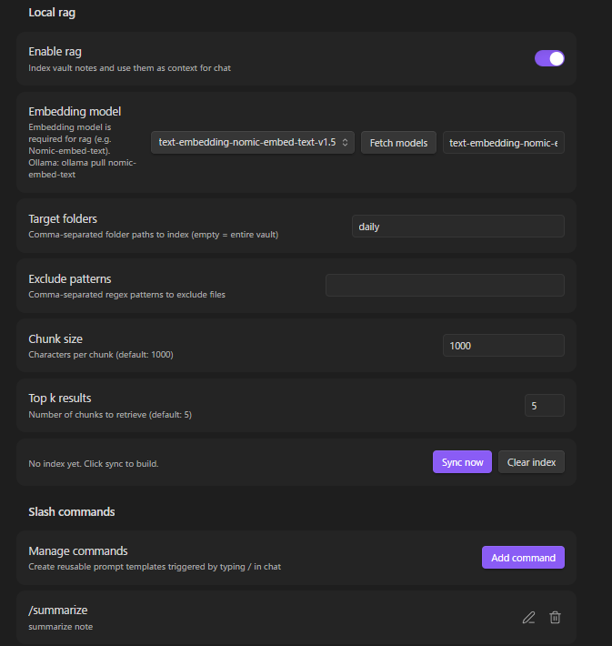

### MCP サーバーのセットアップ

1. 設定 → **MCP サーバー** → **サーバーを追加**
2. 設定: 名前、コマンド（例: `npx`）、引数、環境変数（任意）
3. オンに切り替え — stdio 経由で自動接続

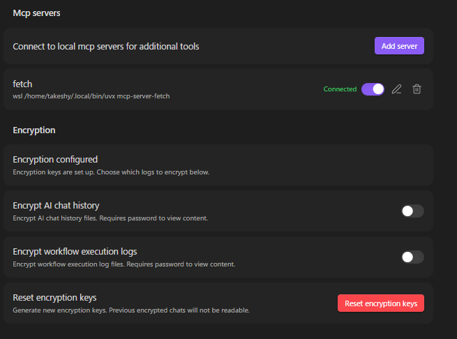

### ワークスペース設定

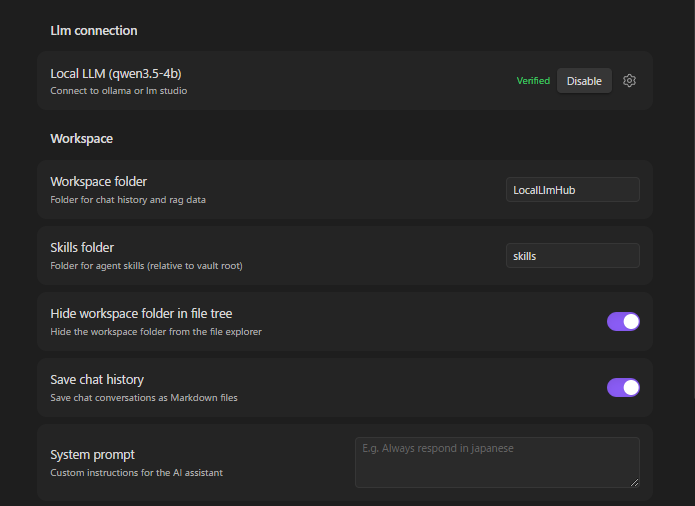

### 対応フレームワーク

| フレームワーク | チャットエンドポイント | ストリーミング | 思考 | Function Calling |
|----------------|------------------------|----------------|------|------------------|
| Ollama | `/api/chat`（ネイティブ） | リアルタイム | `message.thinking` フィールド | `tools` パラメータ |
| LM Studio（OpenAI 互換） | `/v1/chat/completions` | SSE | `<think>` タグ | `tools` パラメータ |
| vLLM | `/v1/chat/completions` | SSE | `<think>` タグ | `tools` パラメータ |
| AnythingLLM | `/v1/openai/chat/completions` | SSE | `<think>` タグ | `tools` パラメータ |

### クラウド LLM の利用（OpenAI、Gemini 等）

「LM Studio（OpenAI 互換）」フレームワークは、クラウドサービスを含むすべての OpenAI 互換 API エンドポイントで動作します:

| サービス | ベース URL | API キー |
|----------|-----------|----------|
| OpenAI | `https://api.openai.com` | OpenAI API キー |
| Google Gemini | `https://generativelanguage.googleapis.com/v1beta/openai` | Gemini API キー |

**クラウド LLM で RAG を使う場合**: クラウド LLM はローカルの埋め込みモデルを直接利用できません。RAG を使うには、RAG 設定の **Embedding サーバー URL** にローカルの Ollama インスタンス（例: `http://localhost:11434`）を指定し、`nomic-embed-text` などの埋め込みモデルを選択してください。

---

## インストール

### BRAT（推奨）
1. [BRAT](https://github.com/TfTHacker/obsidian42-brat) プラグインをインストール
2. BRAT 設定 → "Add Beta plugin"
3. `https://github.com/takeshy/obsidian-local-llm-hub` を入力
4. Community plugins 設定でプラグインを有効化

### 手動インストール
1. リリースから `main.js`、`manifest.json`、`styles.css` をダウンロード
2. `.obsidian/plugins/` に `local-llm-hub` フォルダを作成
3. ファイルをコピーして Obsidian 設定で有効化

### ソースからビルド
```bash
git clone https://github.com/takeshy/obsidian-local-llm-hub
cd obsidian-local-llm-hub
npm install
npm run build
```

---

## Gemini Helper との関係

このプラグインは [obsidian-gemini-helper](https://github.com/takeshy/obsidian-gemini-helper) の**ローカル専用版**です。同じワークフローエンジン、同じ UX パターンを、クラウド API が使えない環境向けに設計しました。

| | Gemini Helper | Local LLM Hub |
|---|---|---|
| LLM バックエンド | Google Gemini API / CLI | Ollama / LM Studio / vLLM / AnythingLLM / OpenAI 互換 API |
| データの送信先 | Google サーバー | `localhost` のみ |
| ワークフローエンジン | ✅ | ✅（同一アーキテクチャ） |
| RAG | Google File Search | ローカル埋め込み |
| MCP | ✅ | ✅（stdio のみ） |
| エージェントスキル | ✅ | ✅ |
| 画像生成 | ✅（Gemini） | — |
| Web 検索 | ✅（Google） | — |
| コスト | 無料 / 従量課金 | **永久無料**（自分のハードウェア） |

最先端のクラウドモデルが必要なら Gemini Helper。**プライバシーが譲れない条件なら Local LLM Hub**。
