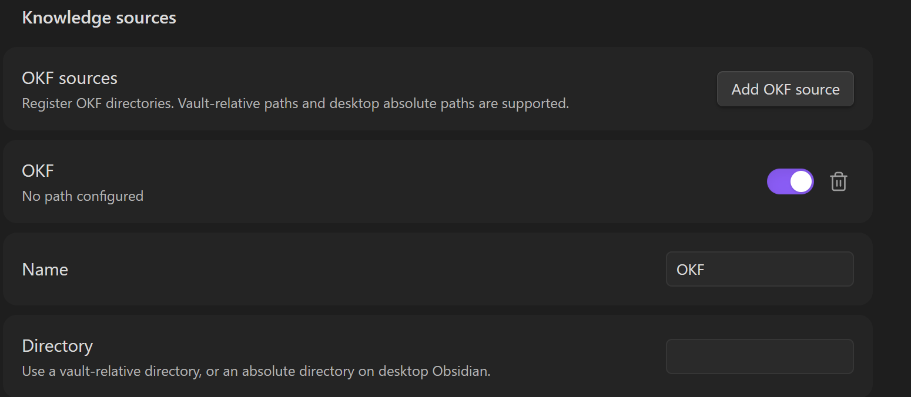

# Agent Skills

Agent skills allow you to inject reusable instructions and reference materials into the AI's system prompt. Each skill is a folder containing a `SKILL.md` file with optional reference files.

## External Skills

External skills are installable skill packages published through the official `takeshy/llm-hub-skills` repository. They are copied into your vault `skills/` folder, then behave like any other custom skill: they appear in the chat skill selector, can be invoked with slash commands, can load references, and can expose workflows through `run_skill_workflow`.



To install one:

1. Open Local LLM Hub settings.
2. Go to **External skills**.
3. Select a compatible skill from **Install a skill**.
4. Click **Install**.
5. Open chat and enable the installed skill from the skill selector.

Installed external skills show their current version. If a compatible newer version exists in the official repository, the settings panel can check and install the update for that skill.

External skills must include both `SKILL.md` and `manifest.json`. The manifest records the skill ID, version, description, and plugin compatibility, so Local LLM Hub can skip incompatible or outdated packages safely.

For repository layout, manifest fields, update rules, and pull request workflow, see [Importing Skills](import_skill.md).

## Folder Structure

Skills are stored under `{workspaceFolder}/{skillsFolder}/` (default: `LocalLlmHub/skills/`). Each subfolder containing a `SKILL.md` is discovered as a skill.

```
LocalLlmHub/
  skills/
    code-review/
      SKILL.md
      references/
        coding-standards.md
        review-checklist.md
    translator/
      SKILL.md
    meeting-notes/
      SKILL.md
      references/
        template.md
```

## SKILL.md Format

Each `SKILL.md` file has YAML frontmatter with metadata, followed by the instruction body in markdown.

```markdown
---
name: Code Review
description: Reviews code for quality, security, and best practices
---

You are an expert code reviewer. When reviewing code:

1. Check for security vulnerabilities (injection, XSS, etc.)
2. Identify performance issues
3. Suggest improvements for readability
4. Verify error handling is adequate

Always provide specific line references and concrete suggestions.
```

### Frontmatter Fields

| Field | Required | Description |
|-------|----------|-------------|
| `name` | No | Display name (defaults to folder name) |
| `description` | No | Short description shown in the skill selector dropdown |

### Instruction Body

The markdown body after the frontmatter is injected into the system prompt when the skill is active. Write clear, specific instructions that guide the AI's behavior.

## Reference Files

Place additional files in a `references/` subfolder to provide context. All files in this folder are loaded and appended to the skill's system prompt section.

```
code-review/
  SKILL.md
  references/
    coding-standards.md    # Your team's coding standards
    review-checklist.md    # Checklist to follow
```

Reference files are included as:

```
### References

[coding-standards.md]
(file contents)

[review-checklist.md]
(file contents)
```

Use references for content that the AI should know but that isn't an instruction — coding standards, templates, style guides, glossaries, etc.

## Using Skills in Chat

1. Skills are automatically discovered from the configured skills folder
2. A skill selector bar (with a sparkle icon) appears above the chat messages when skills are available
3. Click **+** to open the dropdown and check/uncheck skills
4. Active skills appear as chips — click **×** to deactivate
5. Selected skills remain active across messages within the same chat session

When skills are active, the system prompt includes:

```
The following agent skills are active:

## Skill: Code Review

(instructions from SKILL.md)

### References

(contents of reference files)
```

The assistant message metadata shows which skills were used (displayed as "Skills used: ...").

## Skill Workflows

Skills can expose workflows that the AI can invoke during chat via the `run_skill_workflow` tool. Workflows are discovered in two ways:

### 1. Frontmatter Declaration

Declare workflows in the `workflows` array in SKILL.md frontmatter:

```markdown
---
name: Data Pipeline
description: Processes and transforms data
workflows:
  - path: workflows/extract.md
    description: Extract structured data from text
  - path: workflows/transform.md
    description: Transform data format
---
```

| Field | Required | Description |
|-------|----------|-------------|
| `path` | Yes | Relative path from the skill folder to the workflow file (each file holds exactly one workflow) |
| `description` | No | Description shown to the AI (defaults to path) |

The `run_skill_workflow` tool ID is derived from `path` (the `.md` extension is stripped and `/` is replaced with `_`), so each capability path uniquely identifies a workflow within the skill.

### 2. Auto-Discovery

Place workflow files in a `workflows/` subfolder and they are automatically discovered:

```
my-skill/
  SKILL.md
  workflows/
    extract.md      # Auto-discovered
    transform.md    # Auto-discovered
  references/
    schema.md
```

Workflows declared in frontmatter take precedence — if the same path appears in both, the frontmatter version is used.

When a skill with workflows is active, the `run_skill_workflow` tool is automatically added to the available tools, allowing the AI to execute these workflows during chat.

### Returning values to the chat

When the AI invokes a skill workflow via `run_skill_workflow`, **every variable whose name does not start with `__` is automatically returned to the chat AI** as part of the tool result. You do not need to add a trailing `command` node just to "output" a result — simply `saveTo:` the value you want the chat AI to see. Use a `__`-prefixed name for any variable you want to keep internal to the workflow.

A `command` node runs a separate LLM call *inside* the workflow and stores its output to a variable; it does not write directly to the chat. If you want a specific variable rendered verbatim in the chat reply, put that instruction in the SKILL.md instructions body, for example:

> After the workflow completes, output the value of `ogpMarkdown` to the user verbatim, with no additional commentary.

The chat-side AI, guided by those instructions, will include the variable in its response.

### Error recovery

If a skill workflow fails during a chat, the failing tool call shows an **Open workflow** button. Clicking it opens the workflow file *and* switches the sidebar to the Workflow / skill tab so you can edit the flow and re-run. From there, use **Modify workflow with AI** together with **Reference execution history** to let the AI see exactly which step failed and what input caused the failure — then describe the fix and re-run.

## Configuration

In plugin settings under **Workspace**:

| Setting | Default | Description |
|---------|---------|-------------|
| Skills folder | `skills` | Subfolder name relative to the workspace folder |

The full path is `{workspaceFolder}/{skillsFolder}` (e.g. `LocalLlmHub/skills`).

## Examples

### Translator

```markdown
---
name: Translator
description: Translates text between languages
---

You are a professional translator. When translating:

- Preserve the original meaning and tone
- Use natural expressions in the target language
- Keep technical terms consistent
- If the source language is ambiguous, ask for clarification
```

### Meeting Notes

```markdown
---
name: Meeting Notes
description: Structures meeting notes with action items
---

When processing meeting notes:

1. Identify participants and their roles
2. Extract key decisions made
3. List action items with owners and deadlines
4. Summarize discussion points by topic
5. Flag any unresolved issues

Format output using the template in the references.
```

With `references/template.md`:

```markdown
# Meeting: {title}
**Date:** {date}
**Participants:** {list}

## Decisions
- ...

## Action Items
- [ ] {task} — @{owner} (due: {date})

## Discussion Summary
### {topic}
...

## Open Issues
- ...
```

### Writing Assistant

```markdown
---
name: Writing Assistant
description: Helps improve writing style and clarity
---

You are a writing coach. When reviewing text:

- Fix grammar and spelling errors
- Improve sentence structure for clarity
- Suggest stronger word choices
- Maintain the author's voice and intent
- Point out repetition or redundancy

Provide the revised text first, then list the changes you made and why.
```
